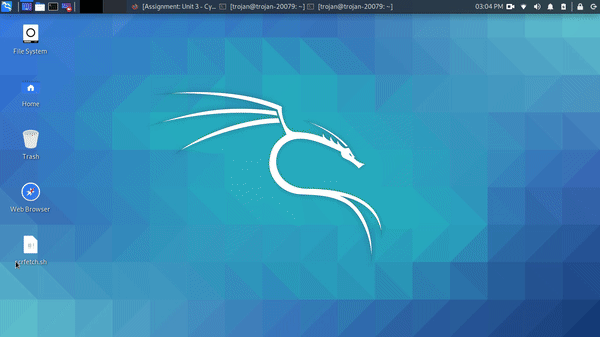

# Kali

```
NOTE
I had already installed Kali on my computer so I didnt install it on a VM. 
There was no way to record the GIF during boot on a physical device so I recorded it using my phone.
```
**Homework Instructions**: 

Create a GIF recording of you running the following command block in your Kali Terminal. Copy it to a text editor first and **replace the first 2 variables, name and univ, with your real name and college name**, then copy/paste the code block into a Terminal. 

```
name="Rohan Ohlan"
univ="San Jose State University"

screenfetch
echo $name'@'$univ
```

Save the file as **screenfetch.gif**.

**Challenges and Problems**: 
### Running screenfetch


### Booting Kali


